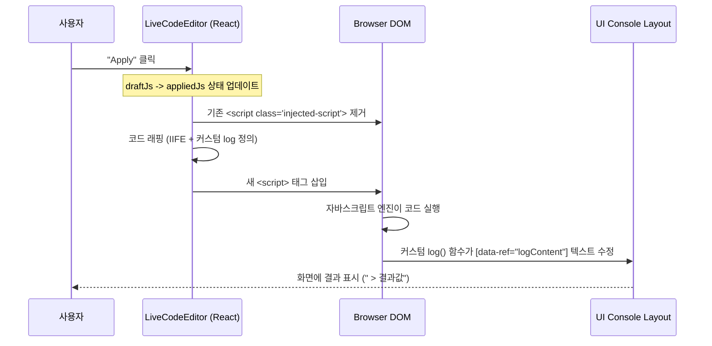

# LiveCodeEditor: Console Output 작동 원리 분석

`LiveCodeEditor`에서 사용자가 작성한 자바스크립트 코드가 실행되고, 그 결과가 화면의 "Console Output" 박스에 실시간으로 표시되는 과정은 크게 세 가지 기술적 단계(**격리, 주입, 가로채기**)로 이루어집니다.

---

## 1. 기술적 도전 과제 (The Problem)

일반적인 브라우저 환경에서 `console.log()`를 호출하면 개발자 도구(F12) 콘솔에만 출력됩니다. 하지만 우리는 다음 기능을 구현해야 했습니다:
- **UI 연동**: 실행 결과를 웹 페이지 내부의 특정 HTML 요소에 표시.
- **다중 인스턴스 대응**: 한 페이지에 여러 개의 에디터가 있을 때, 각 코드가 자신의 콘솔 박스에만 출력되도록 보장.
- **실시간 실행**: 사용자가 "Apply"를 누를 때마다 코드를 즉석에서 평가(Evaluate).

---

## 2. 해결 방법: 3단계 메커니즘

### Step 1: 스코핑 (Scoping & Isolation)
각 에디터는 부모로부터 전달받은 고유한 `scopeId` (예: `js-basics-vars`)를 가집니다.

코드 실행 시, 전체 코드를 **즉시 실행 함수(IIFE)**로 감싸서 실행합니다.
```javascript
(function(containerId) {
  // 이 함수 내부에서는 containerId를 통해 오직 "나의 영역"만 찾을 수 있음
  const _ctx = document.getElementById(containerId);
  
  // 사용자가 작성한 코드...
})("js-basics-vars");
```
이 구조 덕분에 특정 에디터에서 실행된 코드가 다른 에디터의 DOM을 건드리는 사고를 방지합니다.

### Step 2: 출력 가로채기 (The "Log" Hijack)
브라우저의 `console.log`를 바꾸는 대신, 사용자의 코드 실행 직전에 해당 스코프 내에서만 유효한 **커스텀 `log` 함수**를 정의하여 주입합니다.

```javascript
const log = (msg, isErr = false) => {
  // 1. 나의 컨텍스트(_ctx) 내부에서만 'logContent' 요소를 찾음
  const content = _ctx.querySelector('[data-ref="logContent"]');
  
  if (content) {
    // 2. 포맷팅: 객체면 예쁘게 줄바꿈(JSON), 아니면 일반 텍스트
    const formattedMsg = typeof msg === 'object' ? JSON.stringify(msg, null, 2) : msg;
    
    // 3. 누적: 기존 텍스트 뒤에 새 메시지 추가
    const prefix = content.innerText ? '\n> ' : '> ';
    content.innerText += prefix + formattedMsg;
  }
};
```
사용자가 코드에 `log("Hello")`라고 적으면, 전역 함수가 아니라 **방금 주입된 이 커스텀 함수**가 실행되어 화면을 업데이트하게 됩니다.

### Step 3: 동적 스크립트 주입 (Dynamic Script Injection)
리액트의 상태(`appliedJs`)가 변경될 때마다 브라우저 엔진이 이를 "새로운 실행 명령"으로 인식하게 해야 합니다.

1.  **기존 흔적 제거**: 이전에 삽입했던 `<script class="injected-script">` 태그를 찾아 삭제합니다.
2.  **새 태그 생성**: `document.createElement('script')`로 실제 스크립트 객체를 만듭니다.
3.  **코드 결합**: "Step 1의 IIFE + Step 2의 log 함수 + 사용자의 원본 코드"를 하나의 문자열로 합쳐 `script.textContent`에 넣습니다.
4.  **강제 실행**: `container.appendChild(script)`를 실행하는 순간, 브라우저는 이 태그를 읽고 즉시 자바스크립트를 구동합니다.

---

## 3. 요약 프로세스 다이어그램



---

## 4. 왜 `logContent`를 못 찾는 경우가 생기나요?

주로 두 가지 이유입니다:
1.  **ID 중복**: `scopeId`가 고유하지 않으면 엉뚱한 콘솔 박스에 글을 쓰려다가 실패할 수 있습니다.
2.  **렌더링 타이밍**: 리액트가 HTML 구조를 다 그리기도 전에 스크립트가 실행되면 `_ctx.querySelector`가 `null`을 반환합니다. 이를 위해 코드에서는 `setTimeout(..., 150)`을 사용하여 DOM 배치가 끝난 뒤 실행되도록 보장하고 있습니다.
